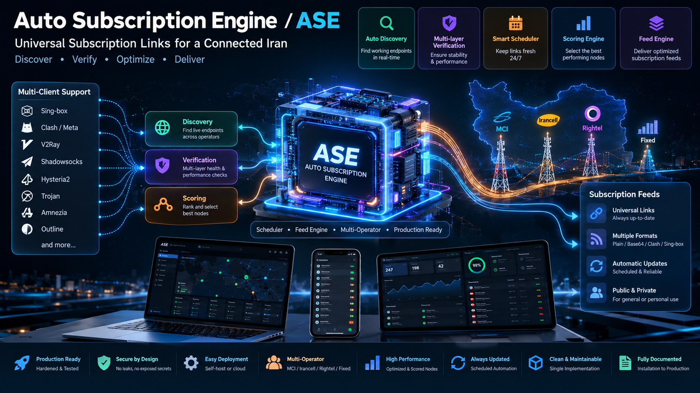
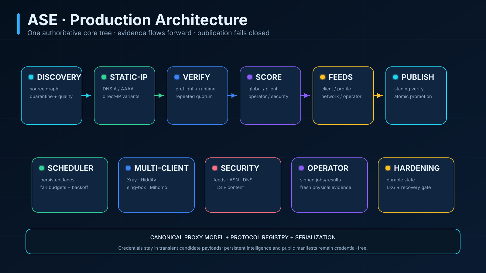
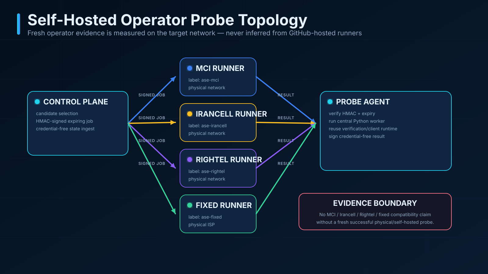
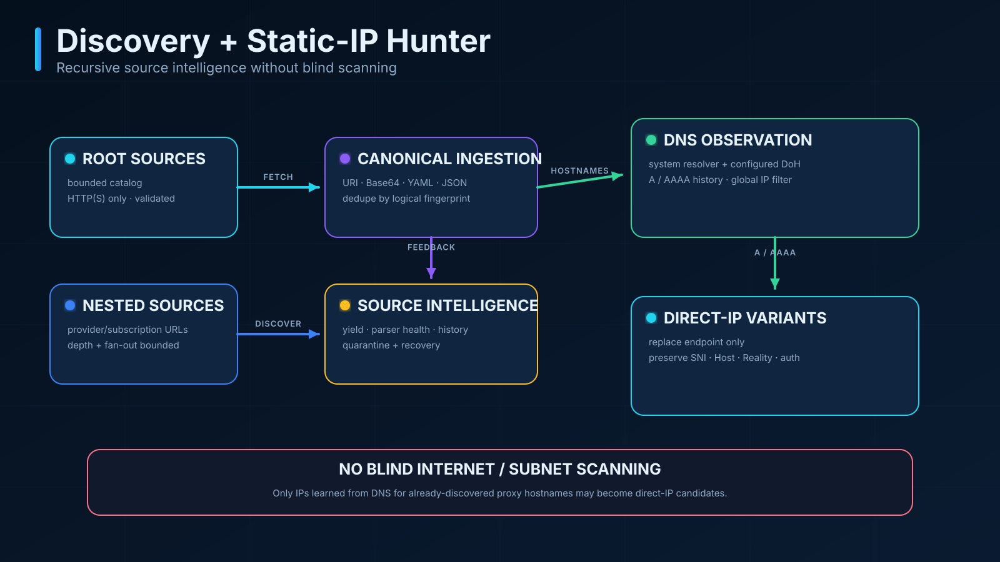
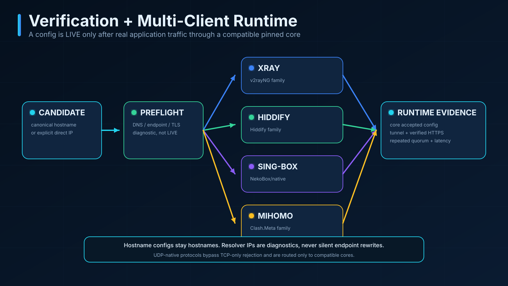
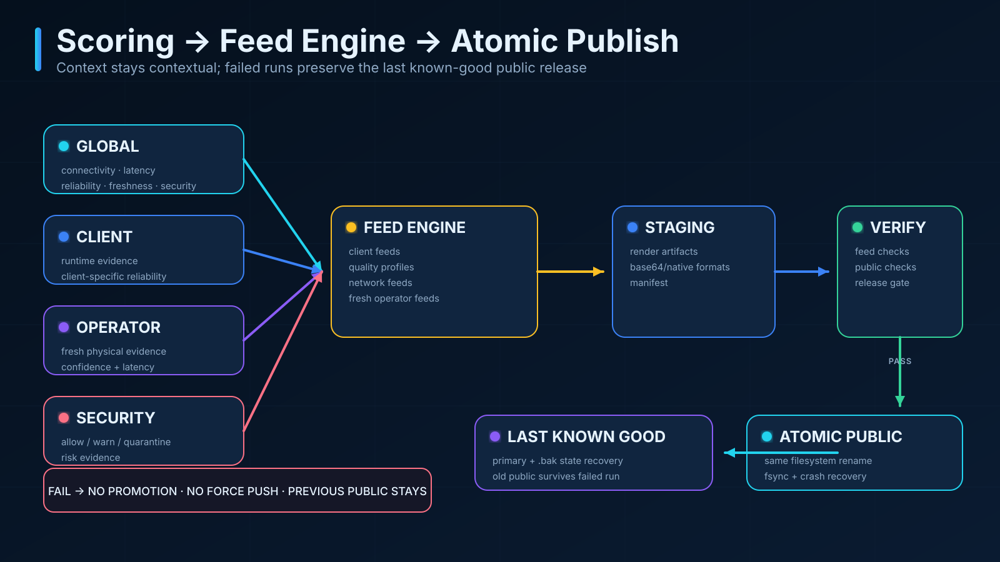
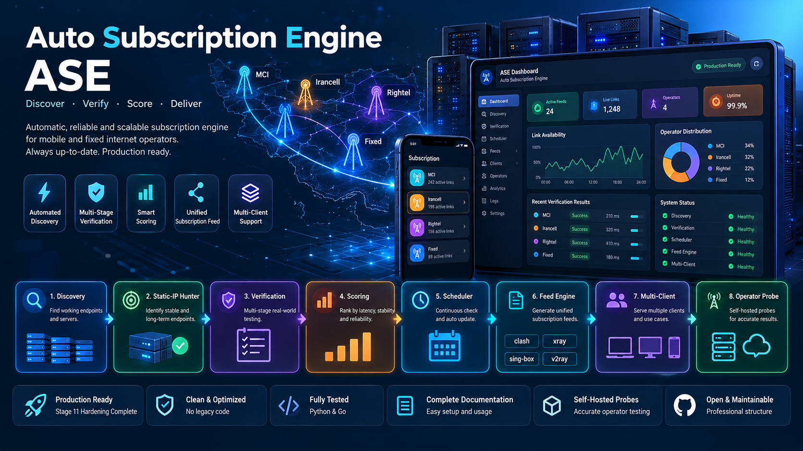

<p align="center">
  
</p>

# Auto Subscription Engine · ASE 1.0

[](https://github.com/Mohamadhosein76/auto-subscription-engine/actions/workflows/build-subscription.yml)
[](https://github.com/Mohamadhosein76/auto-subscription-engine/actions/workflows/ci.yml)

**ASE** is an evidence-driven subscription engine: it discovers public proxy configurations, normalizes them into one canonical model, derives DNS-observed direct-IP variants, schedules bounded verification work, tests candidates through real pinned proxy cores, attaches security/client/operator evidence, scores that evidence and publishes guarded client/network/profile subscriptions.

The defining rule is simple: **syntax is not connectivity, GitHub-hosted connectivity is not Iranian-operator evidence, and a failed run must not replace the last known-good public release.**

> ASE publishes public proxy subscription content. Public proxies are third-party infrastructure and can disappear, change behavior or become unsafe. Use the project’s verification/security evidence as filtering signals, not as a guarantee of privacy or trustworthiness.

## Permanent subscription URLs

Base URL:

```text
https://raw.githubusercontent.com/Mohamadhosein76/auto-subscription-engine/main/public/
```

| Feed | Stable path | Intended evidence |
|---|---|---|
| Main / legacy | `subscription.txt` | score-ranked universal feed after successful modern publication |
| Main Base64 | `subscription_base64.txt` | exact Base64 encoding of the main feed |
| Universal | `clients/universal.txt` | nodes passing all applicable available core requirements |
| v2rayNG family | `clients/v2rayng.txt` | Xray runtime PASS + client score policy |
| Hiddify family | `clients/hiddify.txt` | Hiddify-Core runtime PASS + client score policy |
| NekoBox family | `clients/nekobox.txt` | sing-box runtime PASS + client score policy |
| Mihomo / Clash.Meta | `clients/mihomo.yaml` | native Mihomo YAML from Mihomo-verified candidates |
| Mobile-safe candidates | `networks/mobile-safe.txt` | conservative measured/heuristic network profile — **not an operator guarantee** |
| Published status | `status.json` | safe publication status metadata |

> **Snapshot freshness:** bundled `public/` files are snapshots. For fresh
> feeds run the pipeline or use the current GitHub-hosted feeds. Check
> `public/status.json` (`generated_at`, `last_successful_publish`,
> `source_commit`, `node_count`) or run `auto-subscription-engine status`.

The complete client/profile/network/operator feed contract is documented in **[docs/FEEDS.md](docs/FEEDS.md)**.

Direct stable URLs kept for the public contract:

```text
https://raw.githubusercontent.com/Mohamadhosein76/auto-subscription-engine/main/public/subscription.txt
https://raw.githubusercontent.com/Mohamadhosein76/auto-subscription-engine/main/public/subscription_base64.txt
https://raw.githubusercontent.com/Mohamadhosein76/auto-subscription-engine/main/public/clients/v2rayng.txt
https://raw.githubusercontent.com/Mohamadhosein76/auto-subscription-engine/main/public/clients/hiddify.txt
https://raw.githubusercontent.com/Mohamadhosein76/auto-subscription-engine/main/public/clients/nekobox.txt
https://raw.githubusercontent.com/Mohamadhosein76/auto-subscription-engine/main/public/clients/mihomo.yaml
https://raw.githubusercontent.com/Mohamadhosein76/auto-subscription-engine/main/public/clients/universal.txt
```

### راهنمای سریع فارسی

برای استفاده‌ی محافظه‌کارانه، URL زیر را به‌عنوان Subscription وارد کنید:

```text
https://raw.githubusercontent.com/Mohamadhosein76/auto-subscription-engine/main/public/clients/universal.txt
```

برای v2rayNG می‌توانید از `clients/v2rayng.txt` یا Base64 آن، برای Hiddify از `clients/hiddify.txt` و برای NekoBox از `clients/nekobox.txt` استفاده کنید. این نام‌ها به **evidence هسته‌ی runtime متناظر** اشاره می‌کنند؛ به معنی تست دستی همه نسخه‌های GUI/دستگاه‌ها نیستند.

---

## Windows Quick Start (native, PowerShell)

ASE runs natively on Windows 10/11 — no WSL required. See
**[docs/WINDOWS_SUPPORT.md](docs/WINDOWS_SUPPORT.md)** for the full
validation record.

```powershell
py -3.12 -m venv .venv
.\.venv\Scripts\Activate.ps1
python -m pip install --upgrade pip
pip install -e ".[dev]"

auto-subscription-engine --help
auto-subscription-engine cores-install     # pinned Windows cores (checksum-verified)
auto-subscription-engine status            # feed freshness + staleness warning
auto-subscription-engine diagnose "<config-uri>" --runtime
```

The full local refresh sequence (identical on Windows and Linux):

```text
auto-subscription-engine run            # discovery + normalize + dedup
auto-subscription-engine cores-install  # pinned runtime cores
auto-subscription-engine live           # real connectivity verification
auto-subscription-engine security-check
auto-subscription-engine compat-check
auto-subscription-engine score-check
auto-subscription-engine feed-build
auto-subscription-engine publish
```

## Android Quick Start

Android feed files are mirrored under `platforms/android/` (byte-identical
to the canonical `clients/` artifacts). See
**[docs/ANDROID_CLIENTS.md](docs/ANDROID_CLIENTS.md)**.

| Client | Subscription URL (after the base URL above) |
|---|---|
| v2rayNG | `platforms/android/v2rayng.txt` |
| Hiddify | `platforms/android/hiddify.txt` |
| NekoBox | `platforms/android/nekobox.txt` |
| sing-box | `platforms/android/singbox.json` |
| Mihomo/Clash-compatible | `platforms/android/mihomo.yaml` |

Base64 variants exist for every `.txt` feed. Runtime-core evidence applies;
device-level GUI validation is `device_validation_unknown` — no device is
tested here, and operator compatibility is only ever proven by physical
probes on that network.

## Windows Client Quick Start

| Client | Subscription URL (after the base URL above) |
|---|---|
| Hiddify | `platforms/windows/hiddify.txt` |
| NekoBox | `platforms/windows/nekobox.txt` |
| sing-box | `platforms/windows/singbox.json` |
| Mihomo / Clash.Meta | `platforms/windows/mihomo.yaml` |
| v2rayN | `platforms/windows/v2rayn.txt` (v2rayNG-family URI feed; same Xray runtime evidence) |

## Client support matrix

| Client | Platform | Output | Serializer | Runtime Core | Status |
|---|---|---|---|---|---|
| v2rayNG | Android | `clients/v2rayng.txt` | native URI | Xray-core | Runtime Verified |
| Hiddify | Android + Windows | `clients/hiddify.txt` | native URI | Hiddify-Core | Runtime Verified |
| NekoBox | Android + Windows | `clients/nekobox.txt` | native URI | sing-box | Runtime Verified |
| sing-box | Android + Windows | `clients/singbox.json` | native JSON | sing-box | Runtime Verified |
| Mihomo / Clash.Meta | Android + Windows | `clients/mihomo.yaml` | native YAML | Mihomo | Runtime Verified |
| v2rayN | Windows | `platforms/windows/v2rayn.txt` | shared URI format | Xray-core | Format Supported + Runtime Verified |
| Shadowrocket, Stash, Loon, Surge, Quantumult X | — | — | — | — | Planned (deliberately not publishable without native serialization + runtime evidence) |

**Evidence boundary (important):** CI runtime verification is NOT Android
or Windows GUI device validation. A node can pass server-side runtime
verification and still fail on a specific ISP/device/client combination —
platform feeds therefore apply a stricter, client-aware gate (client
runtime status pass + platform score threshold + evidence from the current
run, no fallback) and their manifests record
`device_validation: manual_observation_only`. Real device observations are
recorded as manual observations only, never as automated evidence, and
operator compatibility is only ever proven by physical probes on that
network.
Status meanings: **Runtime Verified** = the client's runtime core carried
real application traffic through the tunnel on the verification runner.
**Format Supported** = a real serializer produces the artifact but no
separate runtime evidence exists. **Device Evidence Unknown** = no device
test has been run (never claimed). Operator compatibility is a separate
dimension requiring self-hosted physical probes.

## Protocol support matrix

Generated from the central capability registry (`core/clients/registry.py`)
— do not edit by hand.

| Protocol | sing-box | xray | hiddify | mihomo |
|---|---|---|---|---|
| VLESS | ✓ | ✓ | ✓ | ✓ |
| VMess | ✓ | ✓ | ✓ | ✓ |
| Trojan | ✓ | ✓ | ✓ | ✓ |
| Shadowsocks | ✓ | ✓ | ✓ | ✓ (+obfs/v2ray-plugin) |
| Hysteria2 | ✓ | — | ✓ | ✓ |
| TUIC | ✓ | — | ✓ | ✓ |

Transports: TCP/WebSocket/gRPC supported across the matrix; XHTTP on
VLESS for xray and mihomo. Reality follows each core's VLESS support.
A "✓" means the runtime core can be *tested* for that protocol; a node is
only published after real tunneled traffic passes.

## Why ASE is different

ASE does not reduce “works” to “the URI parsed” or “a TCP port opened”. It separates the pipeline into explicit evidence domains:

- **Discovery** — bounded recursive source graph + persistent source quality/quarantine.
- **Canonical ingestion** — URI/Base64/YAML/JSON converge to one proxy model and fingerprint.
- **Static-IP Hunter** — direct-IP variants derived only from DNS A/AAAA observations for discovered hostnames.
- **Smart Scheduler** — persistent exploration/recovery/flaky/healthy/stale lanes instead of fixed-list starvation.
- **Verification v2** — compatible pinned core + real tunneled HTTP/HTTPS + repeated quorum; hostname stays hostname.
- **Security Intelligence** — reputation, ASN, DNS, TLS and content evidence after LIVE verification.
- **Multi-Client Engine** — central capability registry, core lifecycle, native builders/exporters and per-core evidence.
- **Operator Probe System** — signed physical/self-hosted probes; operator evidence is never inferred from GitHub runners.
- **Multidimensional Scoring** — Global, Client, Operator, Reliability, Freshness and Security dimensions stay contextual.
- **Feed Engine** — the one final authority for client/profile/network/operator membership.
- **Production Hardening** — durable state, crash recovery, verified staging and atomic publication.

<p align="center">
  
</p>

See **[Architecture](docs/ARCHITECTURE.md)** for the full design and invariants.

## Evidence boundaries

ASE intentionally distinguishes **unknown**, **unavailable**, **failed** and **passed** evidence.

- No MCI / Irancell / Rightel / fixed-ISP compatibility claim is created without fresh evidence from a self-hosted runner physically attached to that network.
- A missing operator score remains `null`/unknown, not `0`.
- A client that was not actually evaluated can remain unavailable/unknown; a measured client runtime failure can legitimately be a failure/zero context score.
- Runtime-core evidence is not a blanket manual certification of every GUI version, OS or device.
- Shadowrocket, Stash, Loon, Surge and Quantumult X are deliberately **not publishable clients** until ASE has native serialization plus appropriate validation evidence for them.

<p align="center">
  
</p>

## Protocol and runtime capability model

The central parser registry recognizes:

- VLESS
- VMess
- Trojan
- Shadowsocks (`ss`)
- Hysteria2 / `hy2`
- TUIC

Runtime capability is narrower and core-specific:

| Protocol / transport | sing-box | Xray | Hiddify-Core | Mihomo |
|---|:---:|:---:|:---:|:---:|
| VLESS TCP/WS/gRPC/H2/httpupgrade | ✓ | ✓ | ✓ | ✓ |
| VLESS XHTTP/split-http alias | — | ✓ | — | ✓ |
| VMess TCP-ish transports | ✓ | ✓ | ✓ | ✓ |
| Trojan TCP-ish transports | ✓ | ✓ | ✓ | ✓ |
| Shadowsocks plain TCP | ✓ | ✓ | ✓ | ✓ |
| Shadowsocks supported plugins | limited by registry | limited by registry | limited by registry | `obfs`, `v2ray-plugin` |
| Hysteria2 | ✓ | — | ✓ | ✓ |
| TUIC | ✓ | — | ✓ | ✓ |

A parser recognizing a URI does **not** guarantee that every core/client supports every feature carried by that URI. Unsupported mappings stay explicit rather than being silently downgraded.

## Discovery + Static-IP Hunter

<p align="center">
  
</p>

`config/sources.yaml` contains root sources. Discovery can follow nested subscription/provider URLs within strict depth/source/fan-out limits. Fetches run concurrently, but processing is deterministic; source failure is isolated and repeated failures cause temporary quarantine.

For hostname candidates, ASE observes A/AAAA answers and can create separate direct-IP variants. Before replacing the endpoint host it preserves identity-bearing SNI/Host/Reality/auth/path semantics. Private/reserved/non-global addresses are rejected.

**ASE never scans arbitrary subnets or the Internet.** Direct-IP candidates are derived only from DNS evidence for already-discovered proxy hostnames.

## Verification + Multi-Client Engine

<p align="center">
  
</p>

Preflight is diagnostic. LIVE status requires application traffic through a compatible pinned runtime core. Required HTTP/HTTPS targets are repeated and evaluated as a quorum; ASE records latency distributions and failure categories.

Current client/feed mappings:

| Feed family | Evidence core | Output |
|---|---|---|
| v2rayNG | Xray | URI feed |
| Hiddify | Hiddify-Core | URI feed |
| NekoBox | sing-box | URI feed |
| native sing-box | sing-box | JSON |
| Mihomo / Clash.Meta | Mihomo | YAML |

Pinned core archives and SHA-256 values are declared in `config/testing.yaml`. Runtime binaries are checksum-verified, extracted safely, kept out of Git and cleaned up by workflows.

## Scoring → Feed Engine → Atomic Publish

<p align="center">
  
</p>

Scoring does not itself publish nodes. The Feed Engine consumes contextual scorecards and verified evidence, then applies score thresholds, freshness requirements, size limits and diversity rules.

General client/network/profile feeds keep previous-good protection. Operator credential feeds are different: if fresh operator evidence disappears, an old operator feed is **not** preserved as though it were current.

Publication is transactional. A candidate public tree is staged and verified; hardening logic recovers interrupted rename windows, checks same-filesystem atomicity and preserves the previous public tree on failure.

## Installation

Requirements:

- Python **3.12+**
- Go toolchain only if building/testing the self-hosted operator-probe supervisor
- Git

```bash
git clone https://github.com/Mohamadhosein76/auto-subscription-engine.git
cd auto-subscription-engine

python3 -m venv .venv
. .venv/bin/activate
python -m pip install --upgrade pip
python -m pip install -e '.[dev]'

python -m pytest -q
```

The package exposes both:

```bash
python -m auto_subscription_engine --help
auto-subscription-engine --help
```

## Local pipeline

<p align="center">
  
</p>

### 1. Discover / normalize / deduplicate

```bash
auto-subscription-engine run \
  --config config/sources.yaml \
  --discovery-config config/discovery.yaml \
  --discovery-state data/discovery.json \
  --output-dir output

auto-subscription-engine verify --output-dir output
```

### 2. Install checksum-pinned cores

```bash
auto-subscription-engine cores-install \
  --dest .core-bin \
  --testing-config config/testing.yaml
```

### 3. Runtime verification

```bash
auto-subscription-engine live \
  --output-dir output \
  --testing-config config/testing.yaml \
  --core-dir .core-bin

auto-subscription-engine verify-live --output-dir output
```

### 4. Security + client evidence

```bash
auto-subscription-engine security-check \
  --output-dir output \
  --testing-config config/testing.yaml \
  --core-dir .core-bin
auto-subscription-engine verify-security \
  --output-dir output \
  --testing-config config/testing.yaml

auto-subscription-engine compat-check \
  --output-dir output \
  --testing-config config/testing.yaml \
  --core-dir .core-bin
auto-subscription-engine verify-compat --output-dir output
```

### 5. Score + feeds

```bash
auto-subscription-engine score-check --output-dir output
auto-subscription-engine verify-score --output-dir output

auto-subscription-engine feed-build \
  --output-dir output \
  --config config/feeds.yaml
auto-subscription-engine verify-feed --output-dir output
```

### 6. Guarded publication

```bash
auto-subscription-engine publish \
  --output-dir output \
  --public-dir public \
  --testing-config config/testing.yaml

auto-subscription-engine verify-publish --public-dir public

auto-subscription-engine production-check \
  --repo-root . \
  --output-dir output \
  --public-dir public \
  --report output/production_health.json
```

The live pipeline performs real network work. The unit-test suite is deterministic/offline where practical and must not be mistaken for current network evidence.

## GitHub Actions operation

`.github/workflows/build-subscription.yml` supports manual dispatch and the hourly schedule:

```yaml
schedule:
  - cron: "17 * * * *"
```

The job uses a single concurrency group so scheduled runs cannot overlap publication/state writes. It tests the code, builds output, installs pinned cores, performs real verification/security/client/scoring/feed stages, verifies the staged/public result, runs the production release gate and only then enters the bounded auto-commit/push path.

GitHub cron can be delayed by platform load; minute 17 is a schedule request, not an SLA.

## Self-hosted operator probes

The manual `.github/workflows/operator-probe.yml` is intentionally separate from GitHub-hosted general verification. A meaningful operator probe requires a physical runner on the target network and an HMAC secret supplied through GitHub Environment Secrets.

See **[Self-Hosted Operator Probes](docs/OPERATOR_PROBES.md)** for provisioning, security, commands and freshness rules.

## Configuration

Tracked, non-secret configuration:

```text
config/sources.yaml          root source catalog
config/discovery.yaml        discovery bounds and quarantine
config/ip_hunter.yaml        DNS/direct-IP policy and limits
config/testing.yaml          verification/scheduler/scoring/security/client/publish policy
config/feeds.yaml            final feed thresholds/diversity
config/operator_probes.yaml  physical operator profiles and evidence freshness
```

Every public operational knob is documented in **[docs/CONFIGURATION.md](docs/CONFIGURATION.md)**.

## Durable state

Credential-free persistent intelligence:

```text
data/history.json
data/discovery.json
data/ip_history.json
data/operator_probes.json
```

Stage-11 hardening writes durable JSON through same-filesystem temporary files + `fsync` + atomic replace + best-effort directory `fsync`, with last-known-good `.bak` recovery. Unrecoverable corruption fails closed instead of silently resetting history.

## Security model

Security principles include:

- no TLS certificate/hostname verification bypass;
- bounded official/key-free reputation feeds;
- explicit ASN/DNS/TLS/content evidence;
- persistent operational state must remain credential-free;
- proxy core archives are checksum pinned;
- child process groups are terminated on errors/cancellation;
- no force push in operator-state recovery;
- previous public release survives a failed current run.

See **[Security & Production Hardening](docs/SECURITY_AND_HARDENING.md)**.

## Repository layout

```text
.
├── .github/
│   ├── assets/                  GitHub visuals
│   └── workflows/               CI, build/publish, operator probes
├── config/                      tracked non-secret policy
├── data/                        bounded credential-free persistent intelligence
├── docs/                        current architecture/config/feed/security/development docs
│   └── stages/                  historical staged migration records
├── public/                      last successfully promoted public subscription tree
├── src/auto_subscription_engine/
│   ├── __init__.py              package/version surface
│   ├── __main__.py              `python -m` entry point
│   ├── cli.py                   CLI surface only
│   └── core/                    single authoritative production source tree
└── tests/                       regression, architecture, safety and failure-injection tests
```

The package root intentionally contains no parallel parser/network/security/publisher/scoring implementations. `tests/test_central_source_tree.py` guards that rule.

## Development & QA

```bash
python -m pytest -q
python -m compileall -q src tests

git diff --check

cd src/auto_subscription_engine/core/operator_probe/agent
go test -race ./...
go vet ./...
go build -trimpath -o /tmp/ase-operator-probe ./cmd/ase-operator-probe
```

See **[docs/DEVELOPMENT.md](docs/DEVELOPMENT.md)** for the full command sequence and release hygiene.

## Troubleshooting

**A client feed is absent**
The mapped core may have been unavailable or no candidate met current evidence/score policy. ASE does not publish a fake client feed from unverified candidates.

**An operator feed disappeared**
Operator feeds require fresh physical evidence. Stale historical operator credentials are intentionally not preserved as current.

**A hostname works differently from its direct-IP variant**
They are distinct candidates. ASE preserves SNI/Host/Reality identity where possible, but network behavior can still differ.

**`production-check` fails on state**
Treat it as a release blocker. Hardening intentionally prefers preserving the previous healthy public release over resetting corrupt intelligence and continuing.

**Downloaded core cannot install**
Check the official release URL and pinned SHA-256 in `config/testing.yaml`. Do not bypass checksum verification to make the run continue.

**Scheduled workflow starts late**
GitHub scheduled Actions can be delayed. The project protects correctness with workflow concurrency and durable state rather than assuming exact cron start time.

## Documentation

- [Architecture](docs/ARCHITECTURE.md)
- [Configuration reference](docs/CONFIGURATION.md)
- [Feed / URL reference](docs/FEEDS.md)
- [Self-hosted operator probes](docs/OPERATOR_PROBES.md)
- [Security & production hardening](docs/SECURITY_AND_HARDENING.md)
- [Development & QA](docs/DEVELOPMENT.md)
- [Historical implementation stages](docs/stages/README.md)

## Contributing

Keep changes inside the authoritative subsystem under `core/`; do not recreate deleted root implementations or permanent import shims. New client support requires both a real native serializer/builder and an evidence path. New operator-specific claims require a real probe path. Any release-affecting change should include tests that fail if those boundaries regress.
